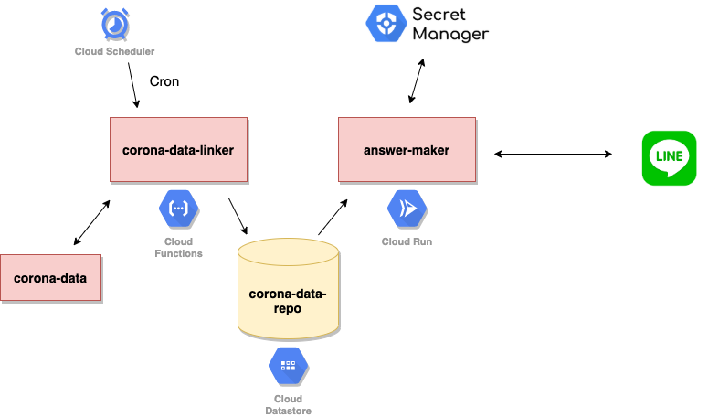

# corona-line-bot
This is the chatbot that you can search corona data by specifying prefecture name.
I made it to learn Python and Design Pattern 'Crean Architecture'.

# Architecture

# corona-data-linker
This function is executed once every three hours by Cloud Scheduler because I don't know that when corona-data is updated.
This sends today's corona data to Cloud Datastore.

# answer-maker
This program is executed by webhook from LINE bot. This get today's corona data from Cloud Datastore then make the answer sentence.

# Secret Manager
This holds the secret data like LINE chat-bot token.
